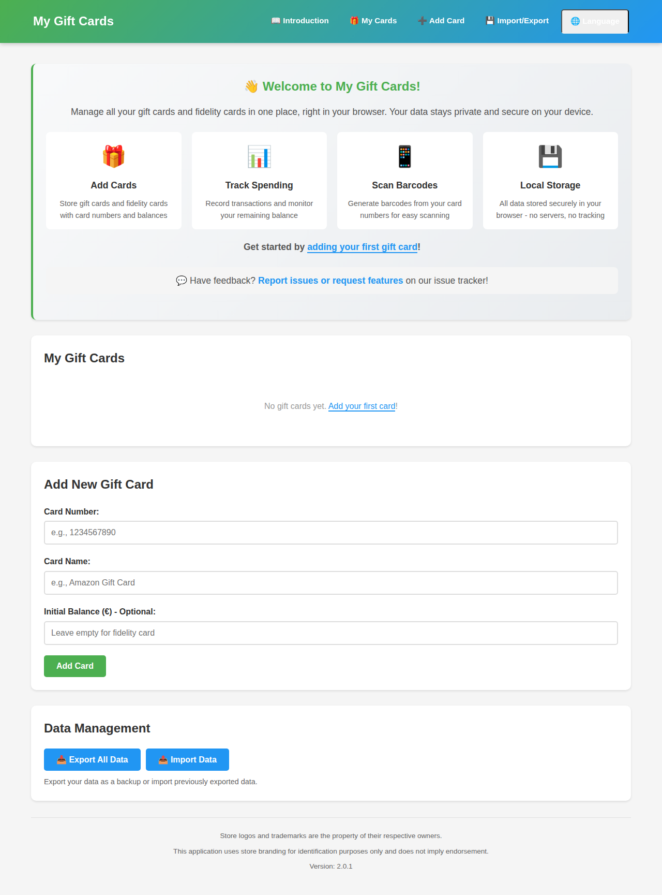
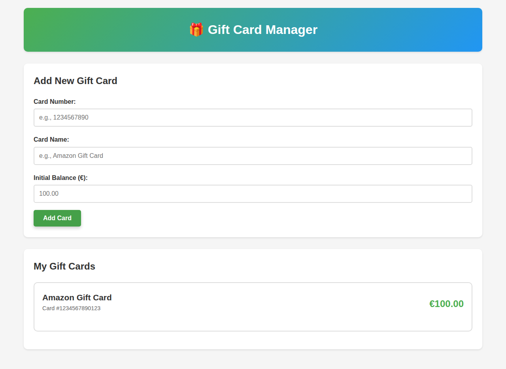
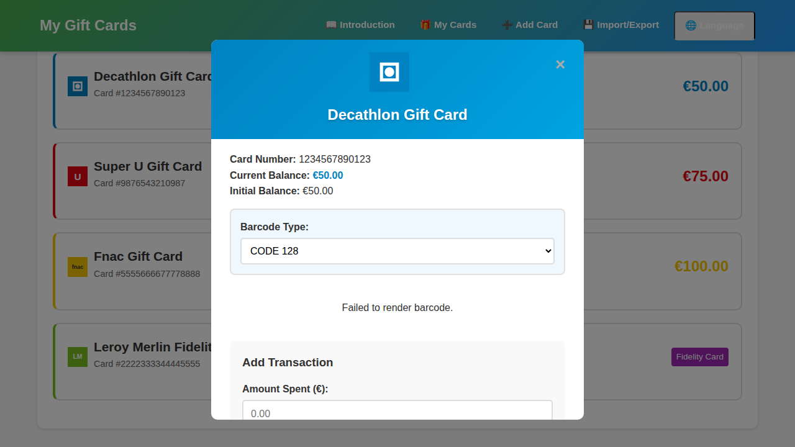
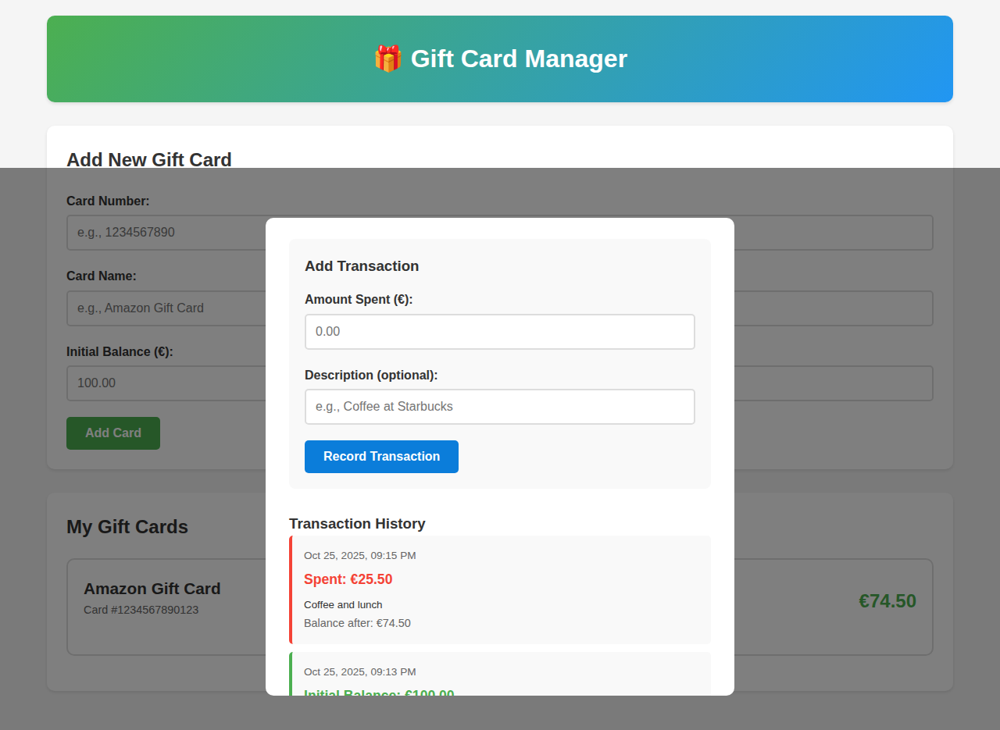
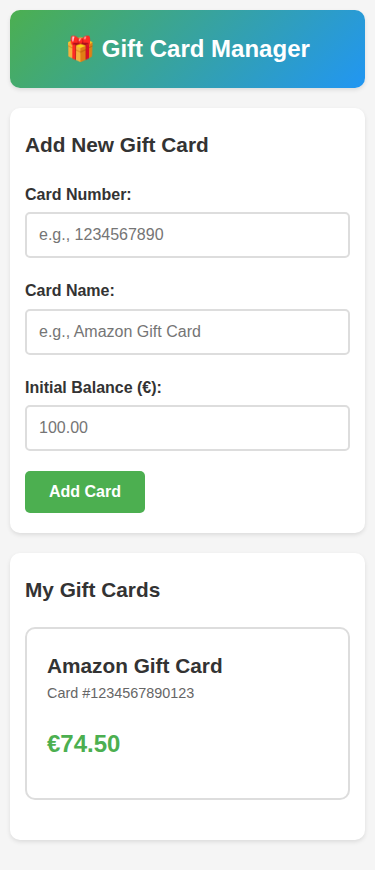

# 🎁 Gift Card Manager

A simple, static web application to manage your gift cards locally in your browser.

## Features

- ✨ **Add Gift Cards**: Create gift cards with custom names, numbers, and initial balances
- 💰 **Track Balances**: Monitor current balance for each card
- 📊 **Transaction History**: Keep detailed history of all spending with dates and remaining balances
- 📱 **Mobile Friendly**: Responsive design that works on all devices
- 📷 **Barcode Generation**: Automatically generate barcodes from card numbers for easy scanning
- 💾 **Local Storage**: All data stored securely in your browser's local storage
- 🚀 **No Backend Required**: Pure static website, perfect for GitHub Pages
- 📲 **Progressive Web App (PWA)**: Install on your device and use offline like a native app

## Screenshots

### Main Interface

*The clean and intuitive main interface where you can add new gift cards*

### Gift Card List

*View all your gift cards with current balances at a glance*

### Card Details & Barcode

*Detailed view with barcode generation and transaction management*

### Transaction History

*Track all your spending with detailed transaction history*

### Mobile Responsive

*Fully responsive design works perfectly on mobile devices*

## Usage

### Live Demo
Visit the live application at: `https://[your-username].github.io/gift-card/`

### Running Locally
1. Clone this repository
2. Open `index.html` in your web browser
3. Start managing your gift cards!

### Installing as a PWA
On **Android**:
1. Visit the live application URL in Chrome or Firefox
2. Tap the menu (three dots) and select "Add to Home screen" or "Install app"
3. The app will be installed on your device like a native app
4. Launch it from your home screen anytime, even offline!

On **iOS** (Safari):
1. Visit the live application URL in Safari
2. Tap the Share button (square with arrow pointing up)
3. Scroll down and tap "Add to Home Screen"
4. Tap "Add" to install the app

On **Desktop** (Chrome, Edge, etc.):
1. Visit the live application URL
2. Look for the install icon in the address bar (or menu)
3. Click "Install" to add the app to your system

## How to Use the App

### Step 1: Adding a Gift Card
1. **Fill in the card details** in the "Add New Gift Card" form:
   - **Card Number**: Enter your gift card number (e.g., 1234567890123)
   - **Card Name**: Give it a friendly name (e.g., "Amazon Gift Card", "Starbucks Card")
   - **Initial Balance**: Enter the current balance in euros
2. **Click "Add Card"** to save the gift card
3. Your card will appear in the "My Gift Cards" section below

### Step 2: Viewing Your Gift Cards
- All your gift cards are displayed in the "My Gift Cards" section
- Each card shows:
  - Card name
  - Card number
  - Current balance in euros
- Click on any card to view its details

### Step 3: Recording Transactions
1. **Click on a gift card** to open the detail modal
2. **Select barcode type** from the dropdown (CODE128, CODE39, EAN-13, etc.)
3. **View the barcode** generated for your card number
4. In the "Add Transaction" section:
   - Enter the **amount spent** (e.g., 25.50)
   - Optionally add a **description** (e.g., "Coffee and lunch")
5. **Click "Record Transaction"** to save
6. The card's balance updates automatically
7. View the **transaction history** below with dates, amounts, and remaining balances

### Step 4: Managing Barcodes
Each card detail page displays a barcode generated from the card number:
- **Choose barcode format** from the dropdown menu
- Supported formats: CODE 128, CODE 39, EAN-13, EAN-8, UPC, ITF-14, MSI, Codabar
- The barcode updates immediately when you change the format
- The selected format is saved for each card

**Note:** The barcode is generated using the bwip-js library and implements standard barcode formats. You can use these barcodes for scanning at stores.

### Step 5: Deleting a Card
1. Open the card detail modal
2. Scroll to the bottom
3. Click "Delete Card" button
4. Confirm the deletion
5. The card and all its transaction history will be permanently removed

## Technology Stack

- **HTML5**: Structure and semantics
- **CSS3**: Responsive styling with mobile-first approach
- **Vanilla JavaScript**: Application logic (no frameworks needed)
- **Canvas API**: Barcode-style visual generation
- **LocalStorage API**: Data persistence
- **Service Worker**: Offline functionality and caching
- **Web App Manifest**: PWA installation support

## Browser Compatibility

Works on all modern browsers that support:
- ES6 JavaScript
- LocalStorage API
- CSS3 Flexbox
- Service Workers (for PWA features)
- Web App Manifest (for PWA installation)

Tested on:
- Chrome/Edge (Android, iOS, Desktop)
- Firefox (Android, Desktop)
- Safari (iOS, macOS)

## Data Privacy

All your gift card data is stored locally in your browser. No data is sent to any server or third party.

## GitHub Pages Deployment

This repository is ready for GitHub Pages:
1. Go to repository Settings
2. Navigate to Pages section
3. Select the branch and root folder
4. Your site will be published at `https://[username].github.io/gift-card/`

## License

MIT License - Feel free to use and modify as needed.